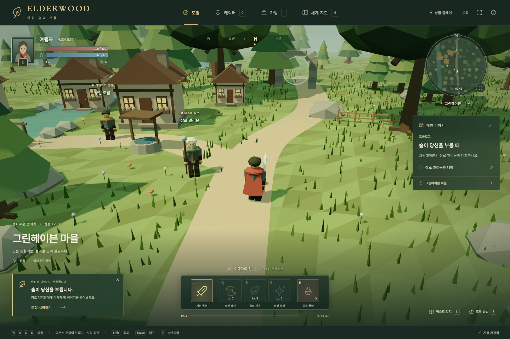

# ELDERWOOD — 잊힌 숲의 부름

브라우저에서 플레이하는 한국어 싱글 플레이 3인칭 3D RPG입니다. Three.js와 TypeScript로 구현했으며, 캐릭터·동물·지형·건물은 프로젝트 코드로 직접 생성합니다.



## 실행

Node.js 22.12 이상을 권장합니다.

```sh
npm install --registry=https://registry.npmjs.org
npm run dev
```

브라우저에서 http://127.0.0.1:5173 으로 접속하세요. WebGL 2를 지원하는 Chrome, Edge, Firefox, Safari에서 실행할 수 있습니다. 첫 화면의 **모험 시작하기**를 누르거나 장로 엘리온에게 다가가 **F**를 눌러 첫 퀘스트를 받습니다. **M**으로 지도를 열고 속삭임의 숲을 선택하면 사냥을 시작할 수 있습니다.

## 게임에 들어 있는 것

- 캐릭터를 따라가는 3인칭 카메라, 카메라 회전과 줌, 지형·건물 충돌, 점프와 무적 회피
- 마을 NPC 대화·상점, 미니맵, 세계 지도와 지역 이동
- 그린헤이븐 마을 → 속삭임의 숲 → 거인의 들판 → 잠긴 신전 → 용의 안식처
- 다람쥐·토끼·소·말·하마·호랑이·상어·고대 용, 추적 AI와 공격 예고, 처치 보상과 일반 몬스터 재등장
- 경험치 획득과 레벨업, 레벨에 비례하는 체력·마력·공격력·방어력, 레벨이 높아질수록 증가하는 필요 경험치
- 검·창·활 교체, 활 투사체, 골드로 구입하고 즉시 장착하는 3단계 갑옷, 회복 물약
- 레벨 2 회전 베기, 레벨 3 숲의 치유, 레벨 5 별빛 낙하, 마력과 스킬 재사용 시간
- 프롤로그·4개 장·에필로그로 이어지는 완료 가능한 메인 이야기, 퀘스트 보상과 지역 해금
- 브라우저 자동 저장, 사망 후 마을 부활, 일시 정지, 효과음과 음소거, 전체 화면, 작은 화면용 메뉴와 터치 이동 버튼

## 조작

| 키 | 기능 |
| --- | --- |
| WASD / 방향키 | 이동 |
| 마우스 오른쪽 버튼 드래그 | 카메라 회전 |
| 마우스 휠 | 확대·축소 |
| J / 마우스 왼쪽 버튼 | 기본 공격 · 누르면 연속 공격 |
| Tab | 공격 대상 변경 |
| 1 / 2 / 3 | 검 / 창 / 활 |
| Q | 회전 베기 · Lv. 2, MP 14, 5초 |
| E | 숲의 치유 · Lv. 3, MP 22, 10초 |
| R | 별빛 낙하 · Lv. 5, MP 35, 12초 |
| Shift | 이동 방향으로 회피 · 1.8초 재사용 |
| Space | 점프 |
| F | NPC 대화 / 차원문 이용 |
| H | 회복 물약 · 체력 60%, 4초 재사용 |
| C / I / M / L | 캐릭터 / 가방 / 세계 지도 / 퀘스트 일지 |
| Esc | 일시 정지 / 열린 창 닫기 |

장비를 교체하면 공격 사거리와 공격 속도가 달라집니다. 근접전이 위험하면 활로 거리를 유지하고, 붉은 공격 예고 원 밖으로 회피하세요. 체력은 비전투 중 서서히 회복되며, 마을에서는 빠르게 회복됩니다. 잠긴 신전의 상어는 별의 저주 때문에 공중을 헤엄칩니다.

퀘스트 목표를 달성한 뒤 오른쪽 **보상 받고 이야기 이어가기**를 눌러야 다음 지역이 열립니다. 지역은 이야기 진행과 레벨 조건을 모두 충족해야 입장할 수 있습니다. 사망해도 레벨·장비·골드·퀘스트는 유지됩니다.

## 저장과 빌드

저장 키는 `elderwood-save-v1`이며, 같은 브라우저의 같은 주소에 자동으로 저장됩니다. 다른 브라우저나 주소와 공유되지 않습니다. 게임 상태는 8초마다, 그리고 처치·구입·지역 이동·퀘스트 완료 시 저장됩니다. 저장이 차단되면 게임 하단에 임시 플레이로 표시됩니다. **Esc → 새 게임**에서 초기화 여부를 확인한 뒤 저장을 초기화할 수 있습니다.

```sh
npm run build
npm run preview
```

배포용 정적 파일은 `dist/`에 생성됩니다. 서버 API나 API 키는 필요하지 않습니다. 글꼴은 Google Fonts를 사용하며 접속이 불가능하면 시스템 글꼴로 표시됩니다.

## 검증

```sh
npm test
npm run test:e2e
```

- Vitest: 경험치 누적·여러 레벨 상승·최대 레벨, 모든 장의 입장 레벨, 퀘스트 중복 보상 방지, 스킬 조건, 물약·갑옷 구매, 잘못된 저장 복구
- Playwright: 실제 Chrome의 WebGL 렌더링, 이동·시점 회전·장비 교체·저장 복원, 전투와 경험치·스킬·사망·부활, 상점, 퀘스트, 전 지역 렌더링과 용 전투·에필로그, 모바일 화면과 터치 입력

브라우저 검증에는 설치된 Google Chrome을 사용합니다. 스크린샷과 실패 시 추적 기록은 `test-results/`에 생성됩니다. 테스트 준비용 게임 상태는 개발 서버에서만 `window.__ELDERWOOD__`로 확인할 수 있으며, 배포 빌드에서는 노출하지 않습니다.

## 주요 파일

- `src/game/state.ts`: 레벨, 능력치, 아이템, 몬스터, 이야기, 저장 데이터
- `src/game/models.ts`: 3D 캐릭터·동물·무기·나무·건물
- `src/game/world.ts`: 지형, 지역 환경, 충돌 영역, NPC·차원문 위치
- `src/game/engine.ts`: 렌더링, 카메라, 입력, 전투, AI, 효과음
- `src/main.ts`: 한국어 HUD, 퀘스트·장비·상점·지도·대화 화면
- `src/style.css`: 데스크톱과 작은 화면용 UI

렌더러 구성은 [Three.js 공식 문서](https://threejs.org/manual/en/creating-a-scene.html)를 참고했습니다. 현재는 로컬 저장 기반의 싱글 플레이 게임이며, 온라인 멀티플레이나 계정 서버는 포함하지 않습니다.
