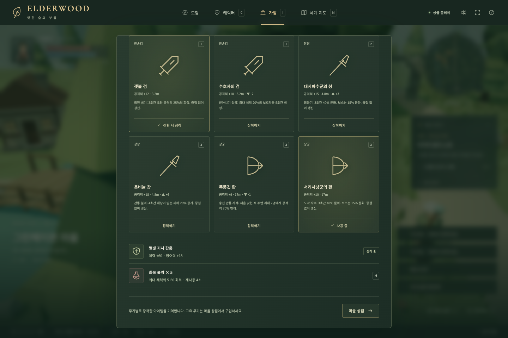
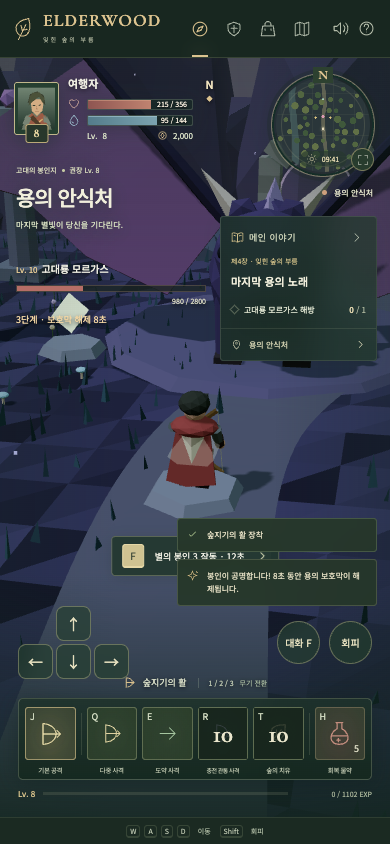

# 1차 개선 — 무기에 따라 달라지는 전투

작성일: 2026-09-09 · 기준 커밋: `53abd60` (원래 작업 폴더의 `42e83cb`와 파일 내용 동일)

상태: v1.1 구현·검증 완료

상위 계획: [개선 로드맵](ROADMAP.md)

## 목표와 범위

같은 숲과 같은 용 보스에서도 검·창·활에 따라 다른 판단과 조작을 하게 만듭니다. 현재의 5개 지역과 메인 이야기를 사용합니다.

1차 범위는 무기별 스킬 9개, 고유 무기 6개, 기존 8종 몬스터의 전투 패턴, 3단계 난이도, 관련 UI와 저장 호환성입니다. 전투를 읽을 수 있는 공격 예고·궤적·피격 반응을 포함합니다. 모델의 전면 교체와 새 지역·스토리·제작·무기 숙련도는 후속 단계에서 진행합니다.

## 무기와 스킬

| 무기 | 기본 공격 | Q · 공격 | E · 방어 또는 이동 | R · 대표 기술 |
| --- | --- | --- | --- | --- |
| 검 | 짧고 빠른 베기 | 삼연 베기: 전방 적에게 연속 3회 | 받아치기: 짧은 시간 동안 전방 공격 1회를 막고 반격 | 회전 베기: 주변 적을 한 번씩 타격 |
| 창 | 긴 전방 찌르기 | 돌진 찌르기: 전진하며 경로의 적 공격 | 휩쓸기: 전방 부채꼴 공격과 밀어내기 | 관통 일격: 긴 직선상의 적 관통 |
| 활 | 원거리 화살 | 다중 사격: 부채꼴로 화살 발사 | 도약 사격: 뒤로 이동하며 목표를 향해 발사 | 충전 관통 사격: 준비 동작 후 강한 관통 화살 |

- Q/E/R은 현재와 같은 레벨 2/3/5에 자동 해금합니다. 무기를 바꾸면 명칭·아이콘·설명·효과가 함께 바뀝니다.
- 숲의 치유는 공통 능력 T로 이동하고 레벨 3 해금을 유지합니다. H 물약, Shift 회피, 1/2/3 무기 종류 전환을 유지합니다. 기존 별빛 낙하는 이번 스킬 구성에서 제외합니다.
- 각 종류에서 선택한 보유 무기를 기억합니다. 예를 들어 검에서 활로 돌아오면 마지막으로 선택한 활을 장착합니다.
- Q/E/R 각 슬롯의 남은 재사용 시간은 무기나 아이템을 교체해도 유지합니다. 교체로 기술을 즉시 다시 쓰는 동작을 허용하지 않습니다. T와 물약은 독립적인 재사용 시간을 갖습니다.
- 레벨·마력·재사용 시간 조건을 먼저 검사합니다. 조건 실패 시 자원을 소비하지 않습니다. 사용이 시작된 뒤의 빗나감은 마력과 재사용 시간을 돌려주지 않습니다.
- 충전 사격은 R 입력으로 준비를 시작해 자동 발사합니다. 회피나 무기 교체로 취소되면 발사하지 않으며, 이미 소비한 자원은 반환하지 않습니다. 키를 놓는 시점에 의존하지 않아 터치 버튼과 동일하게 동작합니다.
- 삼연 베기는 공격 시작 시 방향과 공격력을 정하고, 각 타격에서 명중을 판정합니다. 진행 중 다른 기술을 중복 실행하지 않습니다. 회피로 취소할 수 있고 취소한 나머지 타격은 발생하지 않습니다.
- 받아치기는 전방의 직접 공격에만 적용합니다. 화상·지면 위험에는 적용하지 않습니다. 일반 적은 반격으로 잠시 멈추지만 보스의 단계 전환은 막지 않습니다.
- 투사체·돌진은 벽과 장애물을 통과하지 않습니다. 밀어내기로 캐릭터가 경계 밖이나 장애물 내부에 들어가지 않게 합니다. 방향·거리·충돌 판정과 화면에 보이는 공격 범위를 일치시킵니다.

피해 배율·마력·재사용 시간·거리·각도는 스킬 정의에 모읍니다. 초기값은 첫 구현에서 정하고, 보통 난이도에서 세 무기로 같은 전투를 진행한 결과를 보고 조정합니다.

## 고유 무기 6개

무기 종류당 2개를 추가합니다. 기존 기본 무기 3개와 합쳐 총 9개를 보유할 수 있게 합니다. 현재의 갑옷 3단계도 유지합니다.

| 아이템 | 종류 | 고유 효과 |
| --- | --- | --- |
| 잿불 검 | 검 | 회전 베기 명중 시 일정 시간 화상 |
| 수호자의 검 | 검 | 받아치기 성공 시 잠시 보호막 |
| 대지파수꾼의 창 | 창 | 휩쓸기 명중 시 적을 잠시 둔화 |
| 용비늘 창 | 창 | 관통 일격 명중 후 대상이 일정 시간 추가 피해를 받음 |
| 폭풍깃 활 | 활 | 관통 사격 명중 시 주변 다른 적에게 번개가 이어짐 |
| 서리사냥꾼의 활 | 활 | 도약 사격 명중 시 적을 잠시 둔화 |

- 기존 상점에서 이야기 진행에 따라 판매를 해금합니다. 1장 완료 후 잿불 검·대지파수꾼의 창·서리사냥꾼의 활, 3장 완료 후 나머지 3개를 구입할 수 있게 합니다. 가격은 기존 퀘스트 보상과 반복 사냥 수입에 맞춰 정합니다.
- 한 번 구입한 무기는 보유 상태로 저장하며 다시 구입해 골드를 잃지 않습니다. 장착 전후 능력치와 고유 효과를 비교할 수 있게 합니다.
- 화상과 둔화는 같은 출처에서 중복 중첩하지 않고 지속 시간을 갱신합니다. 보호막은 최대 체력과 별도이며 만료됩니다. 보스에게는 이동 방해 효과를 줄이되 그 차이를 설명에 표시합니다.
- 번개·화상 같은 추가 효과는 다른 고유 효과를 다시 발동시키지 않습니다. 지속 피해로 적이 죽어도 경험치·골드·퀘스트 처리는 한 번만 실행합니다.
- 전투 능력치가 높은 무기 하나로 선택이 고정되지 않도록, 각 무기에 생존·다수전·거리 유지 등의 장점을 배분합니다.

## 몬스터와 용 보스

| 몬스터 | 패턴 | 대응 방법 |
| --- | --- | --- |
| 다람쥐 | 거리를 벌리고 도토리 투척 | 투사체를 피하며 접근하거나 활로 대응 |
| 토끼 | 측면 도약 후 짧은 돌진 | 도약 방향을 보고 돌진 후 빈틈 공격 |
| 소 | 예고 후 긴 직선 돌진 | 옆으로 회피하고 회전하는 동안 반격 |
| 말 | 짧은 돌진 후 재배치 | 첫 회피 뒤 다음 접근 방향 확인 |
| 하마 | 전방 물기와 원형 충격파 | 전방과 주변 위험 범위를 구별 |
| 호랑이 | 측면 접근, 몸을 낮춘 뒤 도약 | 준비 자세를 보고 회피·받아치기 |
| 상어 | 잠시 잠행한 뒤 예고된 위치로 돌출 | 바닥의 물결 표식을 보고 이동 |
| 용 | 지상 공격 → 공중 화염 → 봉인 장치 전투 | 단계별로 공격·회피·상호작용을 전환 |

상어는 1차에서 기존 잠긴 신전 바닥에 저주받은 물결을 만들고 그 안으로 잠행합니다. 본격적인 수중 지형과 수면 연출은 그래픽·신규 지역 단계에서 다룹니다.

용은 체력 70%, 35%에서 다음 단계로 넘어가는 것을 초기 기준으로 삼습니다. 지상에서는 발톱·꼬리, 공중에서는 방향이 표시된 화염을 사용합니다. 비행 중에도 근접 무기로 공격할 수 있는 착지 구간을 둡니다. 마지막 단계에서는 경기장의 봉인 장치를 F로 작동해 짧은 공격 기회를 만듭니다. 장치는 키보드와 화면의 상호작용 버튼 모두로 작동합니다.

몬스터 행동은 대기·접근·준비·공격·회복·사망으로 구분합니다. 공격 준비 중 계속 플레이어 쪽으로 방향을 수정하지 않도록, 예고 후 공격 방향이나 위치를 고정합니다. 사망·지역 이동 시 예약된 공격과 투사체·지속 효과를 정리합니다. 보상은 한 번만 지급합니다.

엔딩을 이미 본 캐릭터도 용의 안식처에서 보스 연습전을 시작할 수 있게 합니다. 연습전은 이야기 상태를 되돌리지 않고 경험치·골드·퀘스트 보상을 지급하지 않습니다. 별도 재도전 보상과 도전 던전은 4차 범위입니다.

## 난이도와 성장

| 모드 | 설계 목표 | 주요 조절 요소 |
| --- | --- | --- |
| 이야기 | 탐험과 엔딩을 편하게 경험 | 받는 피해 감소, 긴 공격 예고, 회복 효과 증가 |
| 모험 | 회피·거리·스킬을 활용 | 기준 수치와 표준 패턴 |
| 숙련자 | 패턴 숙지와 장비 선택을 활용 | 일부 추가 연계, 짧은 빈틈, 회복 효과 감소 |

- 기본값은 모험입니다. 마을에서 난이도를 변경하고 저장합니다. 전투 중 변경으로 체력이나 보스를 초기화하지 않습니다.
- 몬스터 체력·피해·예고 시간·회복 배율을 따로 정의합니다. 숙련자에서도 피할 수 있는 예고와 반격 기회를 유지합니다.
- 방어력은 피해에서 직접 빼는 현재 방식에서, 방어력이 증가할수록 피해 감소 효과가 점차 완만해지는 방식으로 바꿉니다. 계산식과 계수는 전투 수치 모듈 한 곳에서 관리합니다.
- 현재 지역 입장 조건과 성장 경로를 유지합니다. 메인 목표만 완료해도 다음 지역의 요구 레벨에 도달해야 합니다.
- 난이도별 기본 경험치·골드와 이야기 보상은 동일하게 둡니다. 사망 시 레벨·장비·퀘스트를 유지합니다.
- 반복 사냥을 요구하지 않는 보통 난이도 완주, 물약 소비량, 무기별 일반전·보스전 소요 시간을 실제 플레이로 확인합니다. 자동 테스트 통과와 재미·난이도 평가는 따로 기록합니다.

## 저장 호환성과 UI

- 기존 `elderwood-save-v1`의 레벨·경험치·체력·마력·골드·물약·갑옷·이야기·처치 기록·지역·음소거·플레이 시간을 보존합니다.
- 새 저장은 `elderwood-save-v2`와 `version: 2`를 사용합니다. 유효한 v2가 없고 v1이 유효하면 이전합니다. 기존 무기는 해당 종류의 기본 아이템으로 연결하고, 추가 무기 보유 목록·종류별 장착 아이템·난이도를 초기화합니다.
- v1 원본은 자동 삭제하거나 덮어쓰지 않습니다. 새 저장 쓰기 실패나 손상된 v2는 사용자에게 알리고 복구를 제공하며, 정상 진행 상황을 새 게임으로 조용히 덮어쓰지 않습니다.
- 새 능력치 상한이 달라지면 체력·마력을 상한 이내로 보정합니다. 단순 재접속으로 회복하는 이득을 만들지 않습니다.
- 전투를 멈추고 저장을 다시 불러오는 방식으로 공격을 반복하지 못하도록, 플레이어의 남은 재사용 시간도 v2에 보존합니다. 실제 사망 후 부활은 별도 처리합니다.
- HUD·캐릭터 창·가방·상점·안내서·터치 버튼·README에 같은 스킬 정의와 조작을 표시합니다. 기존 저장으로 시작한 사용자는 E의 역할 변경과 공통 치유 T를 안내받습니다.

## 구현 순서

| 작업 | 완료 조건 | 상태 |
| --- | --- | --- |
| P1-01 · 데이터와 저장 | 무기 종류·아이템 ID·스킬 정의 분리, v1→v2 이전 및 손상·쓰기 실패 검증 | 구현 완료 |
| P1-02 · 무기별 전투 | 스킬 9개와 공통 치유, 충돌·자원·취소·재사용 시간, HUD 연결 | 구현 완료 |
| P1-03 · 고유 무기 | 6개 효과, 보유·장착·상점·비교·저장, 중복 발동 방지 | 구현 완료 |
| P1-04 · 적과 보스 | 8종 패턴, 예고와 판정 일치, 용 3단계, 보상 없는 연습전 | 구현 완료 |
| P1-05 · 난이도와 완주 | 난이도 선택·저장, 방어 공식, 세 무기로 완주와 수치 조정 | 구현 완료 |

스킬·아이템·전투 판정·저장 처리를 구분해 구현하고, 기존 렌더링과 화면은 그 결과를 사용하도록 연결합니다. 세부 수치는 P1-02부터 실제 정의와 테스트에 고정하고 조정 근거를 이 문서에 남깁니다.

## 1차 완료 기준

- [x] 검·창·활의 9개 스킬이 각각 다른 판정과 동작으로 작동하고, 활에서 회전 베기가 나타나지 않는다.
- [x] 마력 부족·잠긴 레벨·재사용 시간·충전 취소·무기 교체에 대한 자원 처리가 일관된다.
- [x] 벽 너머 타격, 투사체 관통 오류, 범위 밖 명중, 중복 보상 문제가 없다.
- [x] 고유 무기 6개를 정상적인 플레이로 얻고, 효과 차이를 확인하며, 저장 후 재장착할 수 있다.
- [x] 세 무기 모두 기존 이야기와 용 보스를 완료할 수 있다. 난이도별 예고와 대응 기회를 확인한다.
- [x] 기존 진행 중 저장과 엔딩 저장이 보존된다. 엔딩 캐릭터는 보상 없는 보스 연습전을 이용할 수 있다.
- [x] 데스크톱과 터치 화면에서 새로운 스킬·치유·상호작용·설정을 사용할 수 있다.
- [x] 빌드·단위 테스트·브라우저 시나리오가 통과하고, 실제 플레이에서 확인한 밸런스 결과를 기록한다.

## 구현 수치와 검증 기록 · 2026-09-09

수치의 기준은 `src/game/catalog.ts`, 성장과 몬스터 수치는 `src/game/state.ts`입니다. 방어 공식은 `round(피해 × 80 / (80 + 방어력))`, 최소 피해는 1입니다.

| 난이도 | 적 체력 | 적 피해 | 예고 시간 | 공격 후 빈틈 | 회복량 |
| --- | ---: | ---: | ---: | ---: | ---: |
| 이야기 | 0.8 | 0.65 | 1.35 | 1.2 | 1.25 |
| 모험 | 1 | 1 | 1 | 1 | 1 |
| 숙련자 | 1.12 | 1.22 | 0.85 | 0.85 | 0.85 |

용의 기본 체력을 기존 1,400에서 2,800, 공격력을 42에서 48로 조정했습니다. 최초 시뮬레이션에서는 모험의 용 전투가 11~14초에 끝나 패턴을 충분히 보여주지 못했습니다. 조정 후 25~28초이며, 높은 단발 피해가 체력 70%와 35% 경계를 건너뛸 수 없게 했습니다. 2단계 전환 1.8초 동안 피해를 받지 않고 비행 5초·착지 7초를 반복합니다. 3단계는 봉인 3개가 각각 12초에 재충전되며 작동 시 8초간 보호막을 해제합니다.

고유 무기는 1장 이후 100~110 G, 3장 이후 240~260 G입니다. 무기는 구입 후 가방에서 선택하고 갑옷은 구입 즉시 장착합니다. 기존 이야기와 상점 수입으로 구매할 수 있으며 별도 드롭 추첨은 없습니다.

### 자동 완주와 수치 확인

`tests/campaign.test.ts`는 실제 지역의 장애물과 동일한 전투 로직을 0.05초 간격으로 실행합니다. 입력 컨트롤러는 적에게 이동하고 기본 공격·스킬·회피·치유·봉인을 사용합니다. 경험치나 처치를 직접 더하지 않으며, 전투에서 얻은 골드로만 무기·갑옷을 구매하고 장 사이에는 마을에서 30초간 회복합니다. 이야기·모험·숙련자 모두 세 무기로 4개 장을 완료했습니다.

모험 난이도의 결과:

| 무기 | 숲 / 들판 / 신전 전투 시간 | 용 전투 | 캠페인 누적 받은 피해 | 물약 소비 | 용 봉인 사용 |
| --- | --- | ---: | ---: | ---: | ---: |
| 검 | 10 / 16 / 17초 | 25초 | 89 | 0 | 1 |
| 창 | 11 / 13 / 21초 | 25초 | 19 | 0 | 2 |
| 활 | 11 / 15 / 28초 | 28초 | 0 | 0 | 2 |

이는 공격 예고에 즉시 반응하는 자동 컨트롤러의 결과이며 일반 플레이어의 소요 시간이나 체감 난이도 측정은 아닙니다. 무기별 완주 가능성과 자원 고갈·진행 막힘 여부를 확인하는 회귀 기준입니다. 무피해·물약 0회는 실제 사용자에게도 같은 난이도라는 뜻이 아닙니다. 재미와 적절한 긴장감은 사용자의 플레이 피드백으로 후속 조정합니다.

### 브라우저 확인

설치된 Chrome, Playwright, WebGL 소프트웨어 렌더링을 사용해 1440×960과 390×844에서 검증합니다. 용 전투는 키보드 공격·스킬·치유·봉인을 사용해 3단계를 지나 에필로그까지 진행합니다. 대상 접근 위치는 테스트가 정하므로 수동 플레이 시간으로 해석하지 않습니다. 장비 구입·장착과 저장 복구, 터치 치유 T·회피 취소·봉인 F도 브라우저 입력으로 확인합니다.

모바일에서는 용 상태와 지역 제목의 겹침을 수정하고, 모든 스킬 슬롯과 봉인 상호작용을 화면 안에 배치했습니다. 새 기능의 화면 예시는 `docs/screenshots/`에 보관합니다. 용 전투 중 배경 바위·기둥이 시야를 가릴 때 카메라 거리를 줄이고, 너무 가까우면 높은 시점으로 전환하도록 보완했습니다. 월드 이름표는 HUD 영역을 가리지 않게 숨깁니다. 실제 모바일 GPU 성능과 2차의 모델·애니메이션 고도화는 이번 검증 범위에 포함하지 않습니다.

브라우저 용 전투에서는 피해 2,800을 가해 해방했고, 받은 피해 42, 스킬 9회, 물약 0회, 봉인 2회 사용을 기록했습니다. 이 기록은 레벨 8·갑옷 3단계·기본 활로 위치를 정해 진행한 기능 검증입니다.

최종 결과: `npm test` 62개 통과(일반 규칙 13, 전투 31, 저장 9, 캠페인 9), `npm run test:e2e` 11개 통과, `npm run build` 통과. 카메라 보완 후 관련 2개 시나리오와 나머지 9개 시나리오를 나눠 재검증했습니다. 번들 크기 안내(Three.js 포함 약 633 kB, gzip 174 kB)는 남아 있으며 빌드 오류는 없습니다.

