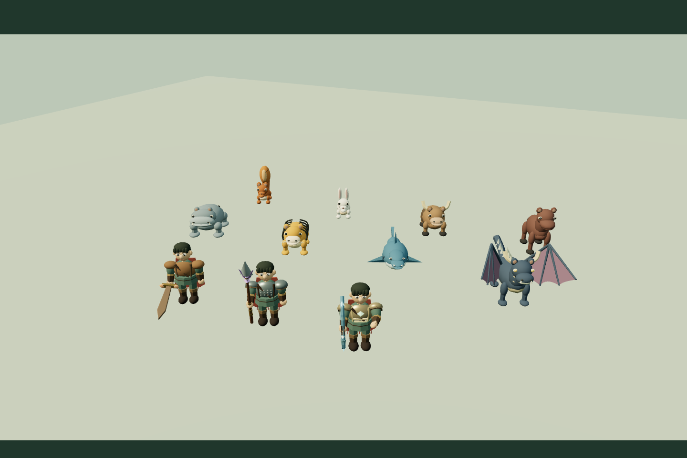
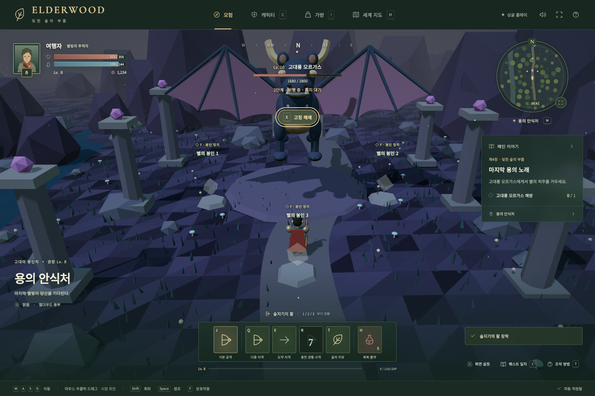
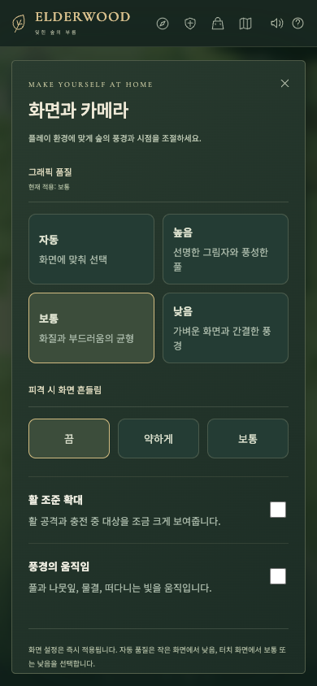

# 2차 개선 — 그래픽과 조작감

작성일: 2026-09-09 · 기준 버전: `7296a2c` · 상태: 완료 · v1.2

## 방향과 범위

기존 카툰풍과 다섯 지역을 유지하며 프로젝트 코드로 모델을 직접 제작합니다. 외부 모델·텍스처 다운로드 없이 캐릭터와 몬스터의 실루엣, 관절 동작, 무기와 갑옷의 차이를 개선합니다. 메인 이야기 확장은 다음 단계입니다.

| 작업 | 결과 | 상태 |
| --- | --- | --- |
| P2-01 모델과 장비 | 사람의 얼굴·손·부츠·갑옷, 무기 9개 외형, 동물별 체형과 용의 목·날개·꼬리 | 완료 |
| P2-02 애니메이션과 타격감 | 관절 보행, 무기별 자세·공격·충전, 몬스터 준비·돌진·착지, 피격 입자 | 완료 |
| P2-03 환경 | 풀과 잎의 바람, 물결과 빛, 지면 접촉 그림자, 읽기 쉬운 공격 예고 | 완료 |
| P2-04 카메라와 조작 | 장애물 가림 대응, 대상 고정, 활 조준 확대, 터치 시점 조작 | 완료 |
| P2-05 화면 설정과 검증 | 자동·높음·보통·낮음, 움직임·흔들림 설정, 저장 호환·성능·브라우저 확인 | 완료 |

## 구현 기준

- 보행은 실제 이동 거리와 연결하고 발·종아리·몸통·팔의 관절을 함께 움직입니다. 대기와 이동, 준비와 공격을 부드럽게 연결합니다.
- 검은 베기와 받아치기, 창은 전방 찌르기, 활은 두 손 자세와 활시위 당기기를 표현합니다. 무기 교체·취소 후 자세가 남지 않습니다.
- 토끼의 도약, 말과 호랑이의 보행, 하마의 무게감, 상어의 꼬리와 잠행, 용의 날갯짓·목·꼬리를 구분합니다. 생물의 공격 예고는 실제 전투 판정에 맞춥니다.
- 기본 무기와 고유 무기 6개의 실루엣·장식·색을 구분하고 갑옷 3단계의 외형도 바꿉니다.
- 피격 효과와 카메라 흔들림은 표현만 바꿉니다. 전투 속도·피해·마력·쿨다운·이야기 보상은 화면 품질과 무관합니다.
- 카메라는 불투명 지형의 가림을 확인하고, 가까운 장애물 때문에 캐릭터 내부로 들어가지 않도록 거리와 높은 시점을 조합합니다. 대상 고정은 X와 화면 버튼으로 켜고 끌 수 있으며 사망·지역 이동·거리 이탈 시 해제합니다.
- 마우스 우클릭 드래그·휠·기존 조작은 유지합니다. 터치는 게임 화면 드래그로 시점을 회전하고, UI 버튼과 이동 패드가 카메라 입력으로 이어지지 않습니다.
- 활 조준 확대는 공격·충전 중만 적용하고 설정에서 끌 수 있습니다. 마우스 휠로 정한 기본 거리를 바꾸지 않습니다.
- 화면 설정은 별도 `elderwood-settings-v1`에 저장합니다. 기존 v1/v2 캐릭터 기록을 변경·초기화하지 않습니다. 설정 저장 실패를 알려주고 당장의 선택은 유지합니다.
- 자동 품질은 화면 크기·터치 여부와 기기의 픽셀 비율을 기준으로 보수적으로 선택합니다. 풀 밀도·입자 수·해상도·그림자를 조절하며, 몬스터 수·장애물·공격 예고는 품질에 따라 사라지지 않습니다.
- 브라우저의 움직임 줄이기 설정을 초기값에 반영합니다. 설정을 바꾸면 이동·전투 중에도 바로 적용됩니다.

## 확인 기준

- [x] 사람·무기·갑옷과 8종 몬스터가 서로 다른 개선 모델로 표시된다.
- [x] 무기별 공격·충전·취소, 몬스터의 보행·준비·비행·잠행이 시각적으로 구별된다.
- [x] 전투 판정과 9개 캠페인 완주 결과가 그래픽 변경으로 달라지지 않는다.
- [x] 품질·효과 설정이 즉시 적용되고 재접속 후 유지되며 캐릭터 진행은 보존된다.
- [x] 대상 고정·활 확대·지형 가림·터치 시점과 기존 조작이 함께 작동한다.
- [x] 화면 크기별 실제 브라우저 캡처와 렌더링 수치를 기록한다.
- [x] 빌드·관련 단위 테스트·브라우저 시나리오가 통과한다.

성능은 측정 환경·해상도·품질·장면과 함께 기록합니다. 소프트웨어 렌더러나 자동 시나리오 수치를 실제 PC·모바일 GPU의 프레임 보장으로 해석하지 않습니다.

## 구현과 검증 결과

- 사람과 동물의 관절을 유지하면서 같은 관절의 정적 메시를 재질별로 합칩니다. 손·얼굴·부츠, 가죽·사슬·별빛 갑옷, 9개 무기와 8종 동물 모델을 직접 제작했습니다.
- 이동 거리로 걸음 주기를 계산합니다. 검·창의 날이 실제 공격 방향을 향하도록 손목 각도를 보정하고, 활 시위를 충전량에 맞춰 당깁니다. 동작 취소·무기 교체 시 자세를 복원합니다.
- 풀과 잎은 GPU에서 흔들리고 물결·빛 입자는 풍경 움직임 설정을 따릅니다. 피격 입자는 최대 160개 배열을 재사용합니다. 낮음에서도 접촉 그림자와 공격 예고가 남습니다.
- 카메라는 중심과 주변 네 시선의 가림을 검사하며 보간·흔들림 적용 후 한 번 더 확인합니다. 큰 바위의 외형을 기존 충돌 반경에 맞췄습니다. 대상 고정 중 큰 몬스터의 높이와 크기에 따라 구도를 조절하며 휠의 기본 거리는 보존합니다.
- 터치 드래그는 공격을 발생시키지 않습니다. 포인터별로 입력을 관리하고 취소·창 전환 시 해제합니다. 모바일에서 메뉴를 바꾸면 새 창의 맨 위부터 표시합니다.

| 품질 | 최대 픽셀 비율 | 그림자 | 풀 최대 | 풍경 입자 | 피격 입자 한도 |
| --- | ---: | --- | ---: | ---: | ---: |
| 높음 | 1.7 | 2048 | 4200 | 100 | 160 |
| 보통 | 1.25 | 1024 | 2500 | 60 | 80 |
| 낮음 | 1.0 | 접촉 그림자 | 1000 | 25 | 40 |

자동은 폭 600 미만, 또는 픽셀 비율 2 초과의 터치 화면에서 낮음을 선택합니다. 그 외 터치 화면은 보통, 데스크톱은 높음입니다. 실제 픽셀 비율은 기기 값보다 높이지 않습니다. 화면 크기가 변하면 자동 품질을 다시 계산합니다.

검증일: 2026-09-09.

- `npm run build`: TypeScript와 배포 빌드 통과. JS 약 660 kB / gzip 183 kB이며 Three.js를 포함한 500 kB 청크 경고는 남습니다.
- `npm test`: **71개 통과**. 기존 62개에 화면 설정·실패·캐릭터 저장 격리, 카메라 장애물, 명시적 조준과 무기 방향·활시위 취소 검증을 추가했습니다. 세 무기 × 세 난이도의 실제 지형 캠페인 9개도 통과했습니다.
- `npm run test:e2e`: **16개 통과**. 기존 11개 시나리오와 새 5개를 함께 실행했습니다. 마지막 모델·대형 대상 구도 보정 후 새 5개를 다시 확인했으며, 비행 시나리오의 시간 설정을 바로잡아 해당 케이스도 재통과했습니다.
- 실제 Chrome에서 이동·장비 구입·저장 이전·오류 복구·용의 세 단계와 에필로그까지 확인했습니다. 별도로 390 × 844 터치 입력, 설정 유지·쓰기 실패·움직임 줄이기, 활 확대 취소, 대상 변경·사망·거리 이탈을 검증했습니다.

### 렌더링 측정

macOS의 headless Chrome, GPU 문자열 `ANGLE (Apple, ANGLE Metal Renderer: Apple M1 Pro, Unspecified Version)`로 측정했습니다. `--enable-unsafe-swiftshader`는 대체 렌더러 허용 옵션이며 이 실행은 실제로 Metal을 사용했습니다. 데스크톱 뷰포트는 1440 × 960, 실제 게임 캔버스는 1440 × 851, 픽셀 비율은 1입니다. 거인의 들판에서 동일한 카메라와 일시 정지 장면을 비교하고 45회의 animation frame 간격을 수집했습니다.

| 장면 | 품질 | 메인 렌더 호출 | 삼각형 | 포인트 | 프레임 간격 중앙값 / p95 |
| --- | --- | ---: | ---: | ---: | --- |
| 거인의 들판 | 높음 | 311 | 119588 | 260 | 33.3 / 33.4 ms |
| 거인의 들판 | 낮음 | 311 | 100388 | 65 | 33.3 / 33.4 ms |
| 마을 · 390 × 844 터치 에뮬레이션, 풍경 움직임 끔 | 낮음 | 87 | 61844 | 40 | 미측정 |

낮음에서 들판의 삼각형은 약 16% 줄었습니다. 양쪽 모두 몬스터 7마리·장애물 62개를 유지합니다. 장비 3종과 갑옷·품질을 3회 반복 교체한 뒤 GPU 지오메트리 수는 **302 → 302 → 302**로 유지됐습니다. 포인트 수에는 재사용 입자 풀의 비활성 슬롯도 포함됩니다. 메인 렌더 호출 수는 추가 그림자 패스의 전체 비용을 뜻하지 않습니다.

자동화 환경의 프레임 간격은 약 30fps에 해당하며 PC 60fps 목표 달성의 증거로 삼지 않습니다. 실제 모바일 GPU와 장시간 전투 성능은 아직 측정하지 않았습니다. 해당 기기의 품질 기본값은 후속 플레이 측정으로 조정할 수 있습니다.

### 실제 화면

모델 비교 화면은 게임에서 사용하는 모델을 테스트용 스튜디오 조명 아래 배치한 것입니다.

다음 단계는 기존 퀘스트의 탐색·구조 요소와 항구·난파선으로 이어지는 두 번째 이야기입니다.
