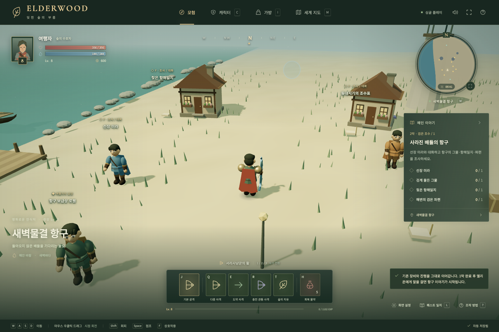
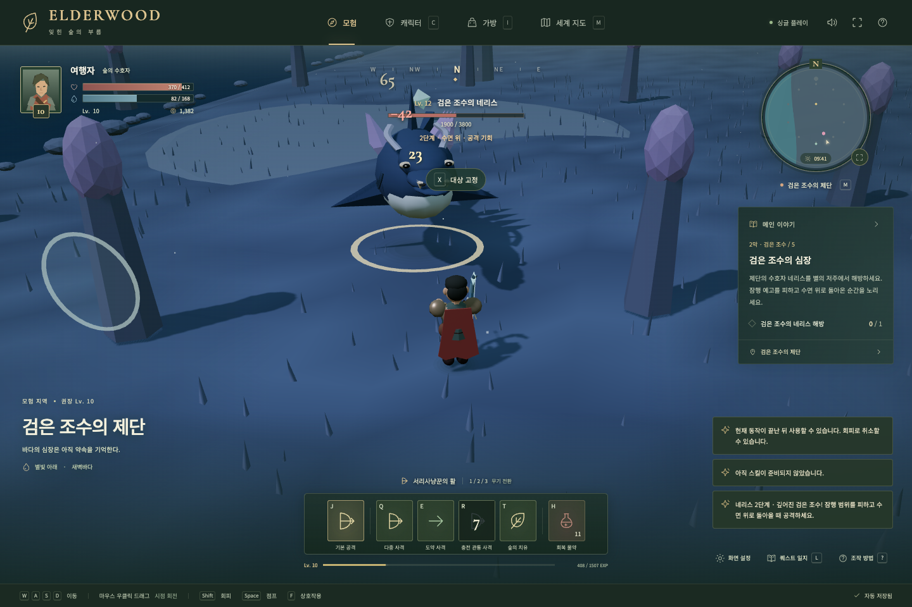
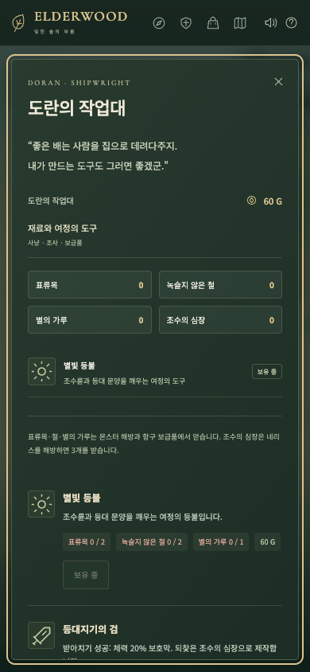

# 3차 확장 — 검은 조수

기준: `60496b7` · 작성일: 2026-09-09 · 상태: 완료 · v1.3

기존 1막의 결말 이후 엘리온의 편지로 시작하는 두 번째 이야기를 구현합니다. 기존 지역의 성장·보상·필수 사냥 목표를 유지하고 선택형 구조 퀘스트를 더합니다.

| 순서 | 플레이 |
| --- | --- |
| 편지 | 1막 에필로그를 마친 캐릭터가 엘리온에게 다음 여정을 받음 |
| 항구 조사 | 선장 미라와 대화하고 그물·항해일지·파편을 조사 |
| 출항 준비 | 조수표를 읽고 조선공 도란에게 재료로 별빛 등불 제작 |
| 난파선 구조 | 조수 장치로 길을 열고 주변 적을 물리쳐 선원 2명 구조, 항구에 보고 |
| 등대 | 비문에서 순서를 추론해 세 문양을 작동하고 등대를 복구 |
| 검은 조수 | 새 심해 보스의 돌진·잠행·광역 패턴에 대응 |
| 귀환 | 수호자의 기억을 읽고 구조된 선원들과 항구에서 2막 마무리 |

추가 범위는 해안 항구·난파선 해안·검은 조수의 제단 3지역, 새 일반 상어와 보스, 재료 4종·등불·제작 무기 3종, 숲의 선택형 조사·구조 이야기입니다. 회복된 등대와 구조된 NPC가 월드에 남습니다. 다음 막의 최종 결말·도전 던전은 후속 단계입니다.

저장은 v3 키를 사용하며 v1/v2를 읽기만 하고 원본을 유지합니다. 첫 모험의 `chapter`는 0~6을 유지하고, 새 이야기 단계·상호작용·재료·조수·퍼즐은 별도로 저장합니다. 손상된 최신 기록은 자동 덮어쓰기 없이 기존 복구 절차로 처리합니다. 화면 설정은 그대로 유지합니다.

진행 보상과 조사물·구조·상자·제작은 중복 수령을 막습니다. 필수 등불 재료는 첫 항구 퀘스트에서 확보할 수 있게 하고, 지도 해금에는 단계와 준비물 조건을 함께 검사합니다. 퍼즐 오답에는 자원을 소모하지 않으며 조수는 시간 제한 없이 직접 전환합니다. 통로 위에서 밀물로 바꾸는 행동은 막습니다.

완료 기준: 이전 캠페인·저장 검증 통과, 모든 무기로 신규 보스 클리어 가능, 새 이야기 순서·중복 방지·잠긴 지역·퍼즐·조수 충돌·제작 검증, 실제 Chrome에서 구버전 엔딩 저장부터 2막 귀환까지 진행, 데스크톱·터치 화면 캡처. 구현과 검증 결과를 아래에 기록했습니다.

## 구현 결과

- 1막 완료 후 엘리온의 편지를 받아 시작합니다. 필수 사냥 목표와 기존 0~6 `chapter`를 유지하며, 2막에는 별도 `journey.step` 0~7을 사용합니다.
- 조사·대화 4개 → 조수표와 등불 → 선원 2명과 구조 보고 → 비문과 문양 → 네리스 → 기억과 항구 인사 순으로 진행합니다. 목표 달성 후 보상을 받아 다음 단계로 넘어갑니다.
- 항구는 안전 지역으로 상점·물약·갑옷·난이도 변경·빠른 회복을 제공합니다. 해안에서 사망하면 진행을 보존하고 항구에서 부활합니다.
- 난파선의 밀물은 이동·회피·돌진을 막는 실제 충돌 영역입니다. 양쪽 조수륜으로 썰물로 바꾸면 중앙 돌길이 열리며, 재접속 후에도 상태를 복원합니다. 오답은 문양 진행만 초기화합니다.
- 조사물·상자·구조는 한 번만 보상하고 대사는 일지에서 다시 읽습니다. 구조된 NPC는 원래 위치에서 사라지고 마을·항구에 나타납니다. 복구된 등대의 불빛과 문양도 유지됩니다.
- 각 무기의 전용 Q/E/R은 유지합니다. 제작 검은 받아치기 보호막, 삼지창은 휩쓸기 둔화, 활은 도약·관통 사격 둔화를 제공합니다. 삼지창에는 세 갈래 창날을 추가했습니다.

## 수치와 진행 기준

| 항목 | 적용값 |
| --- | --- |
| 항구 / 난파선 / 제단 권장 레벨 | 8 / 8 / 10 |
| 필수 등불 | 60 G + 표류목 2 + 철 2 + 별의 가루 1 |
| 항구 조사 보상 재료 | 표류목 3 + 철 3 + 별의 가루 2 |
| 구조 허용 거리 | 대상 3.5m 이내, 대상 주변 6m에 살아 있는 적이 없어야 함 |
| 등대 순서 | 조개 → 달 → 별, 중간 진행 저장 |
| 네리스 기본 체력 / 공격력 | 3,800 / 58, 난이도 배율 별도 |
| 네리스 전환 | 체력 50%, 큰 피해 한 번으로 첫 단계를 건너뛰지 못함 |
| 네리스 패턴 | 직선 돌진 → 플레이어 위치에 고정되는 잠행 원 → 부채꼴 꼬리 공격 |
| 잠행 반경 | 1단계 3.2m / 2단계 4.2m, 잠행 중 피해 무효 |
| 제작 무기 | 각 180 G + 일반 재료 + 조수의 심장 1 |
| 조수의 심장 | 최초 네리스 해방 시 3개, 재등장·재입장 보상 없음 |

Lv. 8 / 경험치 0으로 시작해 필수 이야기 보상만 받아도 제단의 Lv. 10 조건을 충족합니다. 숲의 선택 퀘스트나 반복 사냥을 먼저 완료할 필요가 없습니다. 일반 재료는 사냥과 상자, 항구의 유료 보급으로 충당하며 심장은 판매하지 않습니다. 모든 재료 보상은 저장 상한 999,999를 지킵니다.

## 검증 구성

`npm run build`, `npm test`, `npm run test:e2e`로 확인합니다. 단위·시뮬레이션 94개, 브라우저 19개입니다.

새 캠페인은 Lv. 8, 기본 무기, 갑옷 3단계, 시작 골드 60과 물약 5개로 시작합니다. 실제 지형의 충돌·공격 예고와 이동·회피·스킬을 사용하고, 퀘스트 보상·구조·제작·귀환을 검사합니다. 구조는 조사 대상 근처로 위치를 설정해 상호작용을 검증하고, 전투 중에는 체력·피해·처치 수를 임의로 변경하지 않습니다. 네리스 전투 시뮬레이션은 이야기 / 모험 / 숙련자 각각 검 19 / 29 / 33초, 창 28 / 35 / 37초, 활 34 / 43 / 47초였습니다. 이는 자동 조작의 전투 시간이며 실제 이야기 플레이 시간이나 난이도 만족도 측정은 아닙니다.

Chrome에서는 v2 엔딩 저장으로 엘리온 대화부터 새 엔딩까지 진행합니다. 현장 상호작용의 위치를 고정하고 실제 WASD·F·J·Q·R·T·H, 지도·제작·보상 버튼을 사용합니다. 퍼즐 중간 재접속, v2 원본 바이트 보존, 두 보스 단계, 기억·귀환, 제작한 활의 장착 복원을 확인합니다. 별도 테스트는 숲의 리라 귀환과 390×844 터치 화면의 문양·일지·작업대·지도, 넘침 여부를 확인합니다.

기존 그래픽 품질과 카메라 검증도 함께 실행합니다. 화면은 프로젝트 코드로 생성하며 추가 외부 모델·이미지 자산은 사용하지 않습니다. Vite의 500 kB 초과 번들 경고는 남아 있습니다. 이번 확장에서는 목표 FPS 달성이나 실제 휴대폰 성능을 별도로 주장하지 않습니다.

## 검증 결과와 화면

2026-09-09: 프로덕션 빌드, Vitest 94개, Chrome Playwright 19개가 통과했습니다. 기존 용 전투는 3단계와 에필로그를 완료했고, 신규 네리스 전투는 실제 피해 3,800과 처치 1회를 기록했습니다. 1막과 2막 각각 세 무기 × 세 난이도 9개 조합이 완주했습니다. 화면 설정·그래픽 자원·터치 회전 등 기존 기능의 회귀 검증도 통과했습니다.

항구 상점 바로가기는 해안에서 사용할 때 항구로 돌아오고 실제 상인 앞에 도착합니다. 마을 동선과 함께 관련 Chrome 테스트 3개를 다시 실행해 통과했습니다.

## 다음 범위

2막은 항구 귀환으로 완료됩니다. 하늘나무는 수호자의 기억과 엘리온 대사에 등장하는 다음 이야기의 단서입니다. 3막 최종전, 선택에 따른 분기, 도전 던전, 네리스 재도전 보상은 4차 범위입니다.
