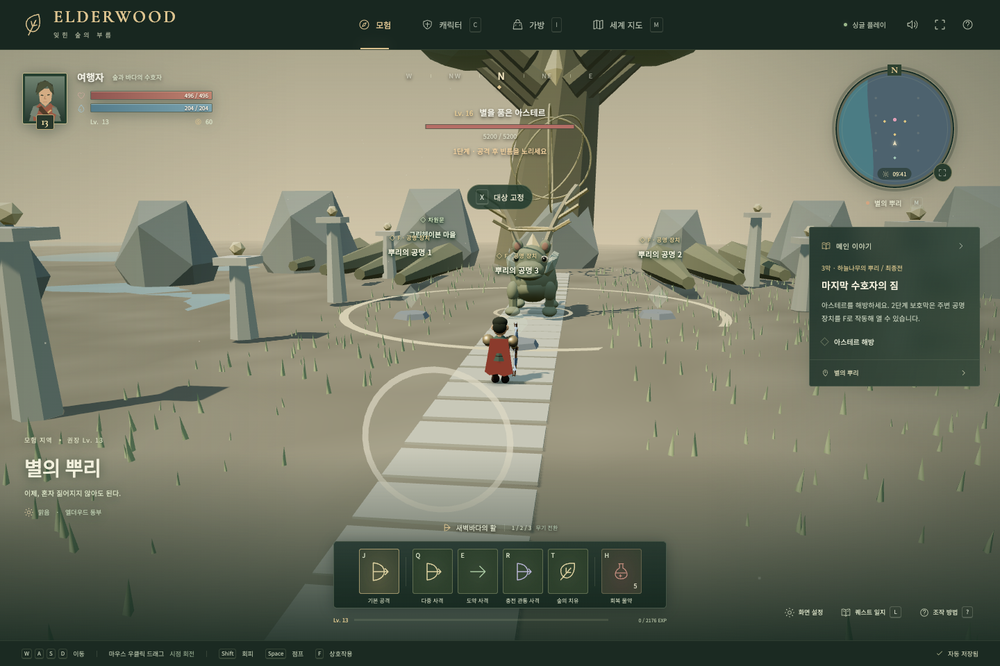
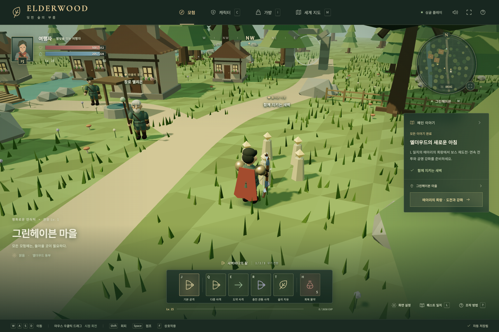
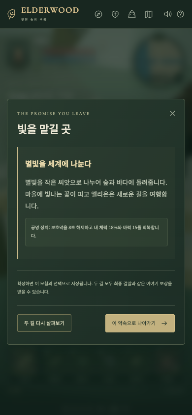
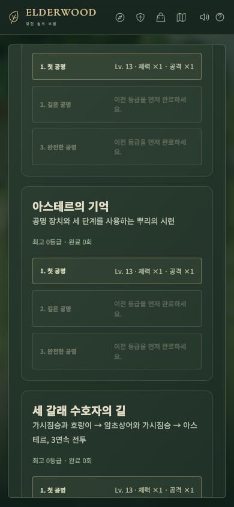

# 4차 — 하늘나무의 뿌리와 메아리의 회랑

기준: `6ddd8ca` · 구현·검증: 2026-09-10 · 상태: 완료 · v1.4

2막 완료 후 엘리온에게 마지막 여정을 받아, 세 수호자에게 나뉜 별빛과 장로의 과거를 연결하는 최종장을 구현했습니다. 선택을 확정하기 전에 결과를 설명하고, 두 선택 모두 최종전과 귀환으로 마무리합니다. 기존 1막·2막의 필수 목표와 보상, 제작 장비는 유지합니다.

## 이야기와 세계

| 순서 | 실제 플레이와 보상 |
| --- | --- |
| 시작 | 2막 엔딩 후 마을의 엘리온 F → Lv. 12부터 하늘나무의 기억 입장 |
| 과거 | 남쪽의 장로·하늘·바다 기록 조사 → 900 EXP, 180 G, 물약 2 |
| 협력 | 엘리온과 대화, 숲·바다 공명석 작동 → 실제 충돌이 해제되는 중앙 다리 → 1,100 EXP, 220 G, 물약 2 |
| 서약 | 북쪽 서약석에서 두 길을 읽고 미리보기·확정 → 800 EXP, 200 G, 물약 2 |
| 최종전 | Lv. 13부터 별의 뿌리에서 아스테르 해방 → 처치 1,900 EXP·800 G, 이야기 1,800 EXP·600 G·물약 2 |
| 귀환 | 수호자의 씨앗을 읽고 마을의 엘리온과 인사 → 900 EXP, 300 G, 물약 2, 최종 엔딩 |

새 일반 적은 가시뿌리 수호수입니다. 나무껍질·가시 외형과 돌진을 사용합니다. 최종 수호자 아스테르는 가지뿔·별빛 핵을 가진 네발 생물입니다. 하늘나무·유적·공명석·회랑을 코드로 생성하고, 중앙 전투 공간에는 장식물을 적게 두었습니다. 재료 4종과 기존 무기별 Q/E/R을 유지합니다.

- **함께 봉인을 지킨다**: 마을과 항구에 황금빛 수호석, 함께 수호를 맡는 이웃들의 대사. 최종전 장치가 보호막을 10초 해제하고 내 최대 체력 20%의 보호막을 줍니다.
- **별빛을 세계에 나눈다**: 마을과 항구에 빛나는 꽃, 씨앗과 새 여행에 관한 대사. 장치가 보호막을 8초 해제하고 체력 18%·마력 15를 회복합니다.

선택 확정 후에는 같은 모험에서 바뀌지 않습니다. 완료한 대사와 선택·결말은 L 일지에서 다시 읽습니다. 귀환 후 세계 풍경과 대사도 재접속 시 복원됩니다.

## 최종전과 도전 수치

아스테르 기본 체력은 5,200, 공격력은 68입니다. 체력 65%에서 공명 보호막, 30%에서 마지막 폭풍 단계로 바뀝니다. 큰 피해 한 번으로 단계를 건너뛸 수 없습니다. 2단계에는 세 장치 중 하나의 3.2m 안에서 F를 눌러 보호막을 해제합니다. 각 장치 재사용은 12초입니다. 원형 뿌리 개화, 직선 광선, 부채꼴 가지 공격은 예고 당시 위치·방향에 고정됩니다. 공격 후 빈틈은 기본 2.2초이고 난이도 배율이 적용됩니다.

최종 엔딩 후 **L 또는 M → 메아리의 회랑**에서 시작합니다. 마을·항구에서 입장하며, 용·네리스·아스테르 단독 재도전과 3연속 전투를 제공합니다. 연속 전투는 수호수·호랑이 → 암초상어·수호수 → 아스테르 순입니다. 기존 용의 보상 없는 연습전도 유지합니다.

| 등급 | 최소 레벨 | 적 체력 / 공격 배율 | 최초 인장 | 매회 EXP / 골드 |
| --- | --- | --- | --- | --- |
| 첫 공명 | 13 | 1 / 1 | 10 | 240 / 100 |
| 깊은 공명 | 14 | 1.25 / 1.12 | 14 | 480 / 200 |
| 완전한 공명 | 15 | 1.55 / 1.25 | 18 | 720 / 300 |

도전마다 이전 등급을 완료해야 다음 등급이 열립니다. 표의 배율에 선택한 이야기·모험·숙련자 난이도가 함께 적용됩니다. 연속 전투의 첫 등급 완료는 인장을 4개 더 주며, 이미 완료한 등급의 반복 보상은 인장 2개입니다. 인장 8/14/20개로 검·창·활별 +1/+2/+3을 강화해 해당 종류의 모든 아이템에 공격력 +4/+8/+12를 적용합니다. 고유 효과와 전용 스킬은 그대로입니다.

도전의 몬스터는 개별 EXP·골드·재료·이야기 처치 수를 지급하거나 재등장하지 않습니다. 마지막 전투 뒤 수령 버튼을 누를 때만 보상을 한 번 지급합니다. 연속 전투는 체력·마력·물약·재사용 시간을 이어가며 전투 사이 메뉴에서 자동으로 전부 회복하지 않습니다. 지역 이동·사망·재접속 시 현재 도전과 미수령 보상은 종료됩니다. 받은 인장·최고 등급·완료 횟수·강화는 유지됩니다.

## 저장

`elderwood-save-v4`에 최종장과 도전 성장 정보를 추가했습니다. v1/v2/v3 원본은 읽기만 하며 장비·재료·현재 체력·마력·재사용 시간·앞선 이야기를 이전합니다. 진행 중인 도전 인스턴스는 저장하지 않습니다. 회랑에서 다시 접속하면 자원을 채우지 않고 마을로 돌아옵니다.

진행 단계에 필요한 이전 목표, 선택과 플래그의 일치, 아직 도달하지 않은 기록, 인장·등급·강화 상한을 검사합니다. 읽을 수 없는 최신 기록은 덮어쓰지 않고 복구 화면을 열며, 복구 시 최신 원본 사본과 이전 버전 원본을 보존합니다. 화면 설정 키는 기존 그대로입니다.

## 검증

- `npm run build`: TypeScript와 배포 빌드 통과.
- `npm test`: 146개 통과. 기존 1막·2막 각 9개 조합을 유지하고, 최종장 2선택 × 3무기 × 3난이도 18개 조합을 완주했습니다. 실제 지형·이동·회피·스킬·공명 장치를 사용하며 전투 중 체력·피해·재사용 시간을 덮어쓰지 않습니다.
- 최종장은 2막 완료 수준의 Lv. 12, 기본 무기, 갑옷 3단계, 60 G와 물약 5개로 시작합니다. 추가 반복 사냥 없이 이야기 보상으로 최종전 입장 조건을 충족하고 귀환 후 Lv. 15가 됩니다. 자동 전투 시간은 검 22~32초, 창 24~36초, 활 26~42초였습니다. 실제 이야기 분량이나 사람의 난이도 만족도를 뜻하지 않습니다.
- 연속 전투는 Lv. 16의 제작 무기 캐릭터로 3무기 × 3난이도 각각 3등급, 총 81개 전투를 검증했습니다. 전투 사이에 자원을 임의로 채우지 않고, 등급 사이에는 마을에서 회복하며 받은 인장으로 강화합니다. 중복 보상·등급 순서·사망·강화 범위·저장 손상과 이전도 검증했습니다.
- Chrome Playwright 전체 25개 통과. v3 저장에서 두 최종 엔딩까지, 실제 WASD 다리 통과·F 선택·J/Q/R 전투·공명 F·귀환·선택 복원, 연속 전투 3회·보상·강화·재접속 중단, 390×844 터치 메뉴와 가로 넘침을 확인했습니다. 브라우저 테스트는 조사와 전투 위치를 고정하되 피해·치유·상호작용은 실제 키와 버튼을 사용합니다.
- 배포 파일에서도 실행하고 개발용 `window.__ELDERWOOD__`가 노출되지 않는 것을 확인했습니다. 첫 화면은 3D 엔진을 늦게 내려받도록 한 상태에서도 표시됩니다. Google Fonts는 비차단 방식으로 내려받고, 연결되지 않으면 시스템 글꼴을 사용합니다. 로딩 조정 후 데스크톱 실행·모바일 메뉴·선택 화면 3개를 추가로 실행해 통과했습니다. 엔진 응답을 보류한 배포 확인에서는 실제 첫 콘텐츠 표시가 308ms에 발생했습니다. 로컬 단일 실행이므로 인터넷 초기 로딩 시간으로 일반화하지 않습니다.

## 성능 측정 범위

UI와 3D 엔진을 나누어 로딩 화면을 먼저 표시합니다. 배포 JS는 초기 UI 약 113.5 kB (gzip 39.7 kB), 이후 엔진 약 628.0 kB (gzip 171.0 kB)입니다. 엔진 청크의 Vite 500 kB 경고는 남아 있습니다. 경고 기준을 높여 감추지 않았으며 전체 게임의 다운로드 크기가 줄었다고 주장하지 않습니다.

2026-09-10, macOS Chrome 152 headless / ANGLE Metal / Apple M1 Pro에서 아스테르 도전 시작 후 179개 프레임 간격을 측정했습니다. 다른 기기나 긴 전투 전체의 프레임 보장은 아닙니다.

| 환경 | 뷰포트 / 그리기 영역 | 품질 | 중앙 / 95백분위 간격 | draw calls / 삼각형 |
| --- | --- | --- | --- | --- |
| 데스크톱 | 1440×960 / 1440×851 | 높음 | 16.7 / 16.7 ms | 107 / 28,516 |
| 같은 Mac의 터치 화면 에뮬레이션 | 390×844 / 390×759 | 낮음 | 16.7 / 16.7 ms | 105 / 28,484 |

유적·뿌리·회랑·항구·마을을 3회 순환한 GPU 지오메트리는 매회 높음 `[294,70,64,271,174]`, 낮음 `[203,70,64,79,131]`로 동일했습니다. 이 측정은 단기 자원 누적이 없다는 확인이며 전체 메모리 누수 부재를 보장하지 않습니다. **실제 휴대폰 GPU와 장시간 플레이 성능은 아직 측정하지 않았습니다.**

## 실제 화면

다음 전장·마을 화면은 검증용 진행 상태를 불러와 촬영한 실제 게임 렌더링입니다. 터치 메뉴는 브라우저 조작 테스트에서 촬영했습니다.

